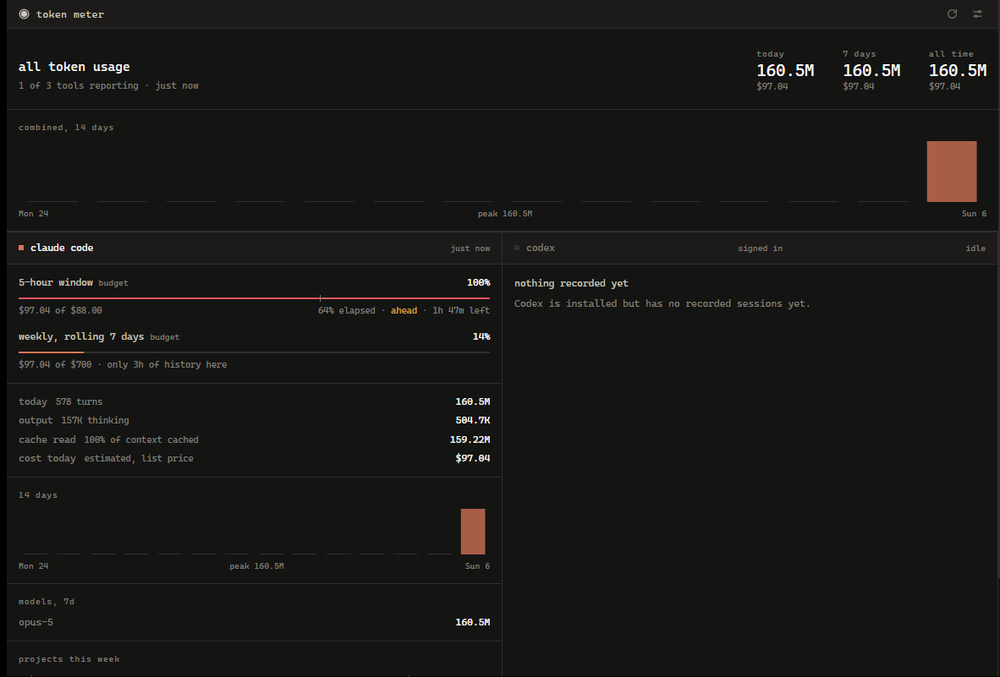

# Token Meter

A Windows tray app that keeps track of how many tokens your AI coding tools are burning through — **Claude Code**, **Codex**, **OpenCode**, and **Antigravity** — and how close you are to running out of runway.

Click the tray coin for a quick panel. Double-click it for the full dashboard.



*The dashboard on a fresh install: one day of local history, so the 14-day charts are mostly empty and Codex has nothing recorded yet. They fill in as you work.*

Everything is read from the files those tools already write on your own machine. Token Meter makes no network calls, sends nothing anywhere, and never writes to another tool's data.

---

## Why the four views look different

Each tool exposes a different shape of information, so each gets a view that suits it rather than one generic table:

| Tool | What you see | Where it comes from |
| --- | --- | --- |
| **Claude Code** | 5-hour and weekly windows against your plan budget, with pace, today's tokens, output vs. thinking, cache hit rate, per-project breakdown | `~/.claude/projects/**/*.jsonl` — the `message.usage` block on every assistant turn |
| **Codex** | The **real** 5-hour and weekly limit percentages OpenAI sends back, with live reset countdowns, plus reasoning and cached-input tokens | `~/.codex/sessions/**/*.jsonl` (`token_count` events carry a `rate_limits` block), falling back to `~/.codex/state_5.sqlite` |
| **OpenCode** | Spend-led: weekly spend against a budget you set, cost per provider and model, per-project cost — because OpenCode runs on your own API keys and records real dollars | `~/.local/share/opencode/opencode.db` |
| **Antigravity** | Detection status, then spend and token totals once it has data to give | `~/.antigravity`, `%APPDATA%\Antigravity` and the other known locations |

The tray panel carries the limit gauges, the day's figures, a 7-day bar chart and the model split for whichever tool you pick.

The dashboard adds the master view on top: combined totals for today, the last 7 days and all time; a 14-day chart across every tool; and per-tool columns with their own 14-day history and project breakdowns.

### Two kinds of gauge

Gauges are labelled so you always know what you are looking at:

- **`live`** — the provider itself told us the percentage. Only Codex does this today.
- **`budget`** — an estimate measured against a number *you* set. Anthropic does not publish plan limits and does not expose them to the machine, so the Claude gauges are reconstructed from your local transcripts.

**Why a `budget` gauge won't exactly match the percentage Claude Code shows you**, and what to do about it:

Providers do not consume a limit at a flat rate per token. Cached input costs roughly a tenth of fresh input, output several times more, and Opus several times Sonnet. Summing raw tokens therefore over-reads a cache-heavy Opus session badly. Token Meter instead weights usage by list price, which is the closest proxy available offline — but the exact weighting is Anthropic's, not published, so a gap remains.

So there is a **calibrate** control in Settings. Read the percentage Claude Code is showing you right now, type it in, and Token Meter solves for the budget that would have produced it. One reading makes the gauge track properly from then on.

The weekly gauge has a second, larger problem: it can only count what is in `~/.claude/projects` **on this machine**. If you use Claude Code on another machine, or your transcripts have been cleaned up, its weekly figure will read low and no calibration can fix that. It says so inline when local history is shorter than a week, and refuses to be calibrated until a full week has accumulated.

Every gauge shows five things, following what [claudebar](https://github.com/mryll/claudebar) and [codexbar](https://github.com/mryll/codexbar) put in Omarchy's bar:

- **percentage used**, and a bar that turns amber at 75% and red at 90%
- **a pace mark** — the tick on the bar showing where usage *would* be if it were spread evenly across the window
- **elapsed**, how far through the window you are
- **ahead / on pace / behind**, the two compared: 40% of the window gone and 70% of the budget spent means you run out early
- **time left** until the window resets

The tray coin stays neutral until something is worth noticing: its face turns amber once any gauge passes 75%, and red at 90%.

Tools that aren't installed are hidden rather than shown as empty tabs, so you only ever see what you actually use.

The interface uses Claude Code's own palette — warm near-black, cream text, clay accent — laid out the way [Omarchy](https://omarchy.org)'s bar is: monospace, flat, unrounded. Colour appears only where it carries meaning.

---

## Install

**Requirements:** Windows 10 or 11, and the [.NET 10 SDK](https://dotnet.microsoft.com/download) to build. The WebView2 runtime ships with Windows 11 and modern Edge — you almost certainly have it already.

```powershell
git clone https://github.com/your-name/token-meter.git
cd token-meter
powershell -ExecutionPolicy Bypass -File install.ps1
```

That publishes a self-contained build to `%LOCALAPPDATA%\TokenMeter`, adds a Start Menu shortcut, registers it to start with Windows, and launches it. The coin appears in your tray — if Windows tucked it into the overflow chevron, drag it onto the taskbar to keep it visible.

To update after pulling changes, run `install.ps1` again. To remove it completely:

```powershell
powershell -ExecutionPolicy Bypass -File uninstall.ps1
```

### Build it yourself instead

```bash
dotnet run tools/IconGen/icongen.cs src/TokenMeter/Assets/app.ico   # only if you change the logo
dotnet build src/TokenMeter -c Release
```

---

## Using it

| Action | What happens |
| --- | --- |
| **Left-click the tray icon** | The compact panel opens next to the tray. It closes when it loses focus, or on `Esc`. |
| **Double-click the tray icon** | The full dashboard opens. |
| **Tabs in the panel** | Switch between the four tools. Your last tab is remembered. |
| **Refresh button**, or `Ctrl+R` | Re-reads everything immediately. It also refreshes on its own every 60 seconds. |
| **Right-click the tray icon** | Dashboard, panel, refresh now, start-with-Windows toggle, quit. |
| **Gear icon on the dashboard** | Settings. |

### Settings

Stored as plain JSON in `%APPDATA%\TokenMeter\settings.json`, editable either in the app or by hand.

| Setting | Default | Notes |
| --- | --- | --- |
| Calibrate 5-hour / weekly | — | Type the percentage Claude Code is showing and the budget is solved for you. The accurate route; see the note on gauges above |
| Claude plan | Max 5x | Rough starting points, since Anthropic publishes no limits. Picking one refills the two budgets below |
| Claude 5-hour / weekly budget | $88 / $700 | Equivalent API spend, the unit a limit is actually consumed in — **not** a bill. On a subscription you are not charged this |
| Codex fallback budgets | $25 / $200 | Only used before Codex has reported a real rate limit |
| OpenCode weekly spend budget | $50 | |
| Antigravity weekly spend budget | $50 | |
| Refresh interval | 60s | Minimum 15s |
| Count cache reads as usage | on | Cached input is billed at a discount but still counts toward limits. Turn it off to see fresh tokens only. |

---

## Notes on the numbers

- **Costs are estimates** wherever the tool does not report them itself. Claude Code, Codex and Antigravity records are priced with a built-in list-price table (`src/TokenMeter/Core/Pricing.cs`). OpenCode reports real cost per message, so its figures are exact. If you are on a subscription rather than paying per token, read the cost column as "what this would have cost on the API".
- **Cache reads are counted by default**, which is why a Claude Code day can read as tens of millions of tokens. That is genuinely what passed through the model; roughly 90%+ of it is usually cached context billed at a tenth of the price. The Settings toggle turns it off if you prefer the fresh-token view.
- **Windows are anchored to the first call after the previous window expired**, not to a fixed clock boundary, which is how these limits are actually enforced. For Claude that anchor is inferred from your local transcripts, so a fresh install has only as much history as it can see; Codex reports its real window, so no inference is needed there.
- **Only what is on disk is visible.** A tool you use on another machine, or one whose history you have cleared, will read as empty.

## Troubleshooting

**A tool shows "Not detected".** Its data folder is not where Token Meter looks. The exact paths are in the table above. Any of them can be pointed elsewhere with an environment variable:

| Variable | Overrides |
| --- | --- |
| `TOKENMETER_CLAUDE_DIR` | `~/.claude` |
| `TOKENMETER_CODEX_DIR` | `~/.codex` |
| `TOKENMETER_OPENCODE_DB` | `~/.local/share/opencode/opencode.db` |
| `TOKENMETER_ANTIGRAVITY_DIR` | all the Antigravity locations |

**A tool shows "Nothing recorded yet".** It is installed but has not written any usage. It will fill in the first time you use it.

**Everything looks stale.** Hit refresh, or check `%APPDATA%\TokenMeter\settings.json` for a refresh interval you set too high.

**Check what a collector actually sees:**

```powershell
& "$env:LOCALAPPDATA\TokenMeter\TokenMeter.exe" --dump snapshot.json
```

That writes the exact payload the UI renders, then exits without touching the tray.

## Layout

```
src/TokenMeter/
  Collectors/     one file per tool, each returning a normalised ProviderSnapshot
  Core/           usage records, aggregation windows, pricing, settings
  UI/             tray icon, the two windows, the WebView2 bridge
  web/            the interface itself: one HTML file, one stylesheet, one script
tools/IconGen/    generates the coin .ico
```

Adding a fifth tool means writing one `IUsageCollector`, returning gauges and stats, and adding it to the list in `Core/UsageService.cs`. The UI renders whatever a collector reports.

## Licence

MIT
